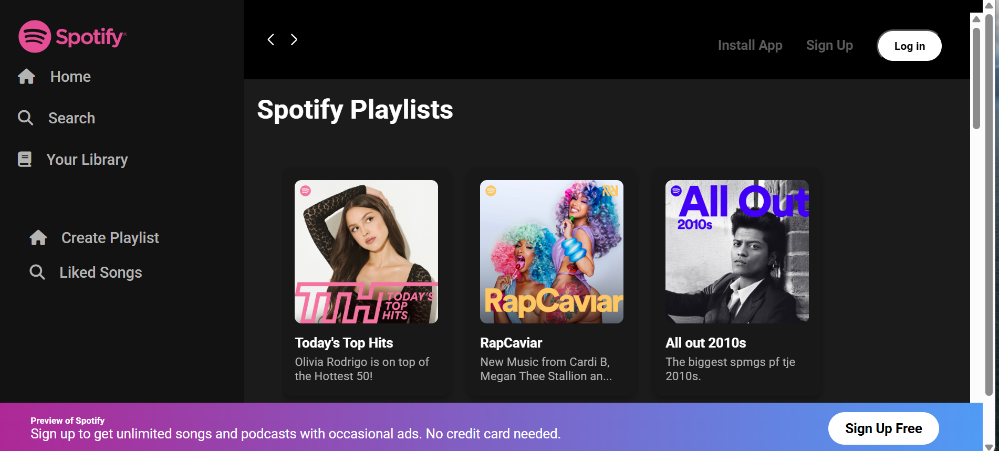

# 🎵 Spotify Clone

A responsive Spotify web UI clone built with HTML, CSS, and JavaScript. This project mimics the look and feel of the official Spotify web player, including a sidebar menu, top navigation, playlists, and a custom audio player.

## 📸 Screenshots

## 🛠️ Technologies Used

- HTML5
- CSS3
- Google Fonts
- Font Awesome / Icons (Optional)

## ✨ Features

- 🎧 Responsive and modern Spotify UI
- 🧭 Sidebar with Home, Search, and Library sections
- 🎶 Playlist cards with album covers
- 🌙 Dark theme styling

